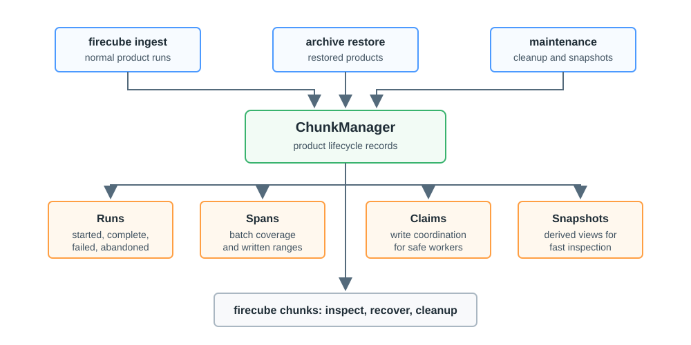

# ChunkManager Records

ChunkManager is Firecube's lifecycle record for one product. It records what ran,
what was written, which write domains were claimed, and which derived views can
be used for fast inspection and cleanup.

Use this page for the concept. Use
[ChunkManager Operations](../operations/chunk-manager/index.md) when you need to
inspect, recover, delete, rebuild snapshots, or migrate a product.

!!! note
    In `firecube chunks`, "chunk" means a ChunkManager record about Firecube
    run/span coverage. It is not a physical Zarr array chunk.

<figure markdown="span">
  { width="820" }
  <figcaption markdown="span">Firecube writes ChunkManager records during ingestion and maintenance. `firecube chunks` reads those records when you inspect, recover, or clean up a product.</figcaption>
</figure>

## What It Records

- **Runs** record one ingestion or maintenance execution and whether it started,
  completed, failed, or was abandoned.
- **Spans** record what a batch wrote, usually with group, time, index, or
  coverage information.
- **Claims** coordinate write domains so conflicting work does not write the
  same product area at the same time.
- **Snapshots** are derived read models used by inspection and cleanup commands.
  They can be rebuilt from the authoritative run history.

## Why It Matters

- Resume checks use ChunkManager before Firecube writes anything.
- Parallel writes use claims and spans to avoid conflicting work.
- Cleanup uses recorded spans instead of guessing from storage paths.
- Inspection commands show product history without requiring you to open the
  output format directly.

## What To Do With It

Start with inspection:

```bash
uv run firecube chunks list \
  --product-name file:///data/products/MY_PRODUCT.zarr
```

Then use the operation page that matches what you found:

- **[Inspect](../operations/chunk-manager/inspect.md)** for detailed lists of
  records, runs, claims, and snapshots.
- **[Recover Runs And Claims](../operations/chunk-manager/recover.md)** when a
  run is stuck or a claim is stale.
- **[Delete And Reingest](../operations/chunk-manager/delete.md)** when records
  or storage data need cleanup.
- **[Snapshots](../operations/chunk-manager/snapshots.md)**
  when snapshots are missing, stale, or need rebuilding.

Do not edit ChunkManager records by hand.

## Next Steps

- **[ChunkManager Operations](../operations/chunk-manager/index.md)** — inspect, recover, delete, rebuild snapshots, or migrate a product
- **[Product Storage](storage.md)** — understand targets, drivers, and write modes
- **[Storage & ChunkManager](chunkmanager.md)** — return to the product storage model
- **[Glossary](glossary.md)** — check related terms such as run, span, claim, and snapshot
