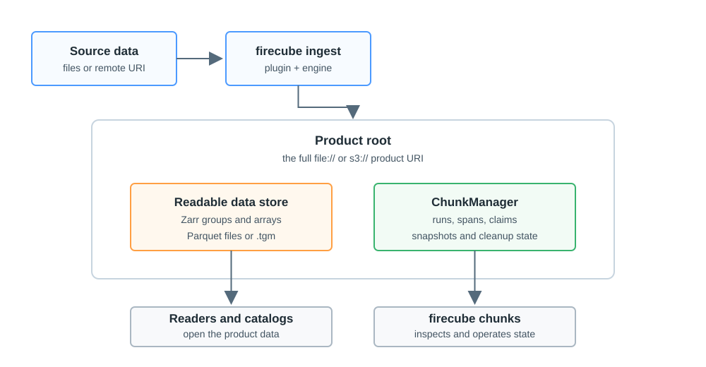

# Storage & ChunkManager

Every Firecube product has two parts: the data store users read and the
ChunkManager records Firecube uses to keep the product inspectable, retryable,
and safe to operate.

The data store is the Zarr store, Parquet dataset, or Tensogram file. ChunkManager
records run history, spans, write claims, snapshots, and cleanup state for that
same product.

<figure markdown="span">
  { width="860" }
  <figcaption markdown="span">The product data is what users and catalogs read. ChunkManager is what Firecube uses to inspect, resume, coordinate, and clean up the product.</figcaption>
</figure>

## When To Use This Section

- You need to choose between a local `file://` target and an `s3://` target.
- You need to choose the storage driver or write mode for an ingest run.
- You want to understand what `firecube chunks` is showing before operating a
  product.
- You are moving, copying, archiving, or restoring a product and need to keep
  Firecube lifecycle state with it.

## How To Think About It

The product URI points to one product root:

```text
file:///data/products/MY_PRODUCT.zarr
s3://bucket/products/MY_PRODUCT.zarr
```

Inside that product root, Firecube writes product data and ChunkManager records
for the same run. Keep them together when you want Firecube to resume, inspect,
recover, or clean up the product later.

ChunkManager records are not physical Zarr chunks. A ChunkManager record is a
Firecube lifecycle record about runs, spans, claims, or snapshots. A Zarr chunk
is a physical array shard inside a Zarr store.

## Next Steps

- **[Product Storage](storage.md)** — choose local/S3 storage, driver, and write mode
- **[ChunkManager Records](chunk-management.md)** — understand runs, spans, claims, and snapshots
- **[ChunkManager Operations](../operations/chunk-manager/index.md)** — inspect, recover, delete, rebuild snapshots, or migrate a product
- **[Storage Driver Compatibility](../reference/storage-drivers.md)** — compare fsspec and obstore support
