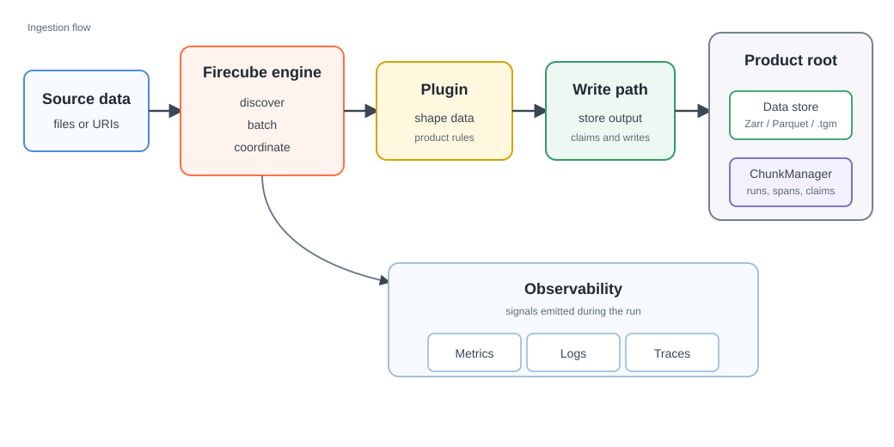

# Concepts

Use these pages to understand how Firecube reads source products, writes
outputs, keeps runs recoverable, and fits into operations. For a first run,
start with the [Quickstart](../quickstart/index.md). For complete command and
configuration surfaces, use the [Reference](../reference/cli.md).

## Choose Where To Start

- **[Configuration Model](configuration.md)** — understand CLI flags, config
  files, environment variables, and plugin options.
- **[Plugins](plugins/index.md)** — choose or build the product-specific code
  that reads source data and shapes output.
- **[Output Formats](output-formats/index.md)** — choose Zarr, Parquet, or
  Tensogram from the shape of the product.
- **[Storage & ChunkManager](chunkmanager.md)** — understand product storage,
  resume state, write coordination, inspection, and cleanup.
- **[Orchestration](orchestration.md)** — run Firecube from CI, cron,
  containers, or an orchestrator.
- **[Observability](observability/index.md)** — inspect metrics first, then
  logs, then traces.
- **[Best Practices & Performance](best-practices.md)** — choose production
  defaults, tune performance, and pick a safe parallel model.

## How Firecube Works

<figure markdown="span">
  { width="900" }
  <figcaption markdown="span">The plugin shapes product data. Firecube handles the operational path around it: batching, writes, ChunkManager records, and observability.</figcaption>
</figure>

Firecube separates product-specific code from ingestion operations. The plugin
knows the dataset. The engine owns discovery, batching, parallel execution,
storage writes, resume checks, cleanup state, and observability.

## Core Ideas

- **Plugins describe the product.** They read source items and shape arrays,
  records, coordinates, variables, and product-specific options.
- **The engine handles the operational work.** Firecube owns discovery,
  batching, workers, storage writes, resume checks, cleanup, and telemetry.
- **Output format follows data shape.** Use Zarr for gridded datacubes, Parquet
  for tabular records, and Tensogram for packaging finished Zarr products.
- **ChunkManager keeps product lifecycle inspectable.** It records runs, spans,
  claims, and snapshots so products can be resumed, inspected, recovered, and
  cleaned up.
- **Parallelism depends on the write model.** Pipeline workers, Parquet file
  writes, Zarr group fan-out, and direct-Zarr slot ranges have different safety
  rules.

## Next Steps

- **[Glossary](glossary.md)** — check Firecube terms without reading every
  concept page.
- **[Plugins](plugins/index.md)** — understand the product-specific side of an
  ingestion.
- **[Output Formats](output-formats/index.md)** — choose the product shape and
  write path.
- **[Storage & ChunkManager](chunkmanager.md)** — understand product state,
  recovery, claims, and cleanup.
- **[Orchestration](orchestration.md)** — run Firecube from another scheduler or
  workflow system.
- **[Observability](observability/index.md)** — inspect metrics, logs, and
  traces.
- **[CLI Reference](../reference/cli.md)** — check the complete command
  surface.
