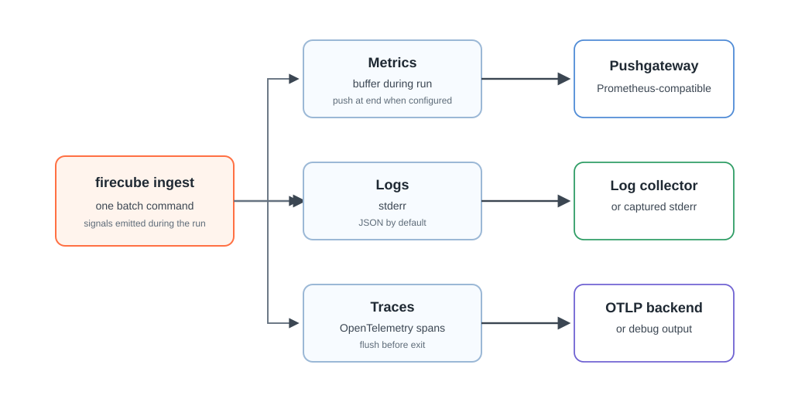

# Observability

Firecube is a batch CLI, not a long-running service. One `firecube ingest`
command emits signals while it runs and flushes what it can before the process
exits.

Start with metrics, then logs, then traces:

- **Metrics** answer how much work happened and how the run performed.
- **Logs** explain what happened during the command.
- **Traces** show where time was spent across phases and batches.

<figure markdown="span">
  { width="860" }
  <figcaption markdown="span">Firecube buffers metrics during the run and pushes them at the end when configured. Logs go to stderr while command output stays on stdout. Traces are exported through OpenTelemetry.</figcaption>
</figure>

## Batch Model

Firecube does not expose a `/metrics` endpoint. A scrape interval can miss a
short command, so Firecube uses a batch-friendly model:

- metrics are buffered during the command and pushed to a Prometheus
  Pushgateway at the end when configured;
- logs are written as the command runs;
- traces are recorded while spans are active and flushed before exit.

ChunkManager is separate from observability. Use ChunkManager operations when
you need to inspect resume state, stuck runs, claims, or cleanup records.

## Where To Start

Use [Metrics](metrics.md) when you need run counts, durations, storage errors,
or product-specific counters and gauges.

Use [Logs](logs.md) when you need command events, error messages, debug output,
or machine-readable stderr.

Use [Traces](traces.md) when you need timing across phases, batches, workers, or
external orchestrator jobs.

Plugin authors emit product-specific metrics and spans through
`ctx.telemetry`. See [Plugin Observability](../../guides/plugins/observability.md) for the
plugin contract.

## Next Steps

- **[Metrics](metrics.md)** — configure Pushgateway metrics and plugin metric emission
- **[Logs](logs.md)** — understand stdout/stderr and JSON log fields
- **[Traces](traces.md)** — configure OTLP tracing and run correlation
- **[Observability Reference](../../reference/observability.md)** — complete metric, environment-variable, label, and span reference
- **[NetCDF To Zarr: Observability](../../tutorials/observability.md)** — add one metric to the NetCDF To Zarr tutorial plugin
