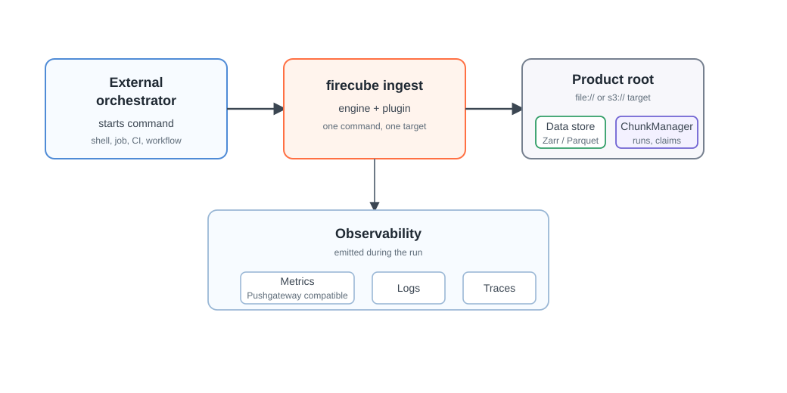

# Orchestration

Firecube does not schedule jobs. It gives you an explicit `firecube ingest`
command that can be started by your external orchestrator.

An external orchestrator is whatever starts the command: a shell, scheduled job,
container entry point, CI step, or workflow system. It decides when commands
start. Firecube decides whether each command is safe to run against the product
it finds.

<figure markdown="span">
  { width="860" }
  <figcaption markdown="span">The external orchestrator starts the command. Firecube writes the product and emits observability for that run, including Pushgateway-compatible metrics.</figcaption>
</figure>

## When To Use This Section

- You want to run Firecube from a scheduler, CI job, container, or workflow
  system.
- You need to know what the external orchestrator owns and what Firecube owns.
- You want to decide what can run concurrently.
- You need retry behavior that does not corrupt product state.

## The Basic Rule

Keep the `firecube ingest` command explicit and portable. The same command shape
should work whether it is started by a local shell, a container entry point, or
a larger workflow system:

```bash
uv run firecube ingest <plugin> \
  --source /data/source \
  --target file:///data/products/MY_PRODUCT.zarr \
  --product-name MY_PRODUCT \
  --storage-type local \
  --storage-driver fsspec \
  --output-format zarr \
  --write-mode direct
```

Then let the external orchestrator handle scheduling, dependencies, resources,
secrets, and log collection around that command.

## Next Steps

- **[Orchestrator Contract](orchestration/external-orchestrator.md)** — split ownership between the external orchestrator and Firecube
- **[Execution Shapes](orchestration/execution-shapes.md)** — choose a shell, scheduled job, container step, or workflow system
- **[Scheduling And Write Safety](orchestration/write-safety.md)** — decide what can run concurrently and what must be serialized
- **[Retries And Recovery](orchestration/retries.md)** — handle failed commands and safe retries
- **[Parallelism](parallelism.md)** — choose workers and write domains by plugin class
- **[ChunkManager Operations](../operations/chunk-manager/index.md)** — inspect or recover stuck runs and claims
