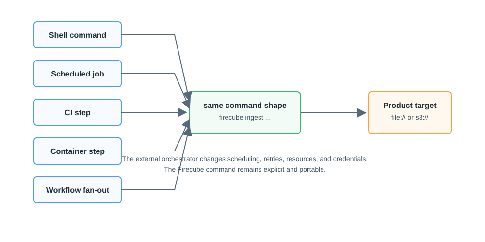

# Execution Shapes

Firecube can run anywhere the `firecube` CLI can run. The command stays explicit;
the external orchestrator changes how it is scheduled, retried, and connected
to storage.

<figure markdown="span">
  { width="860" }
  <figcaption markdown="span">Different external orchestrators can start the same command shape. Firecube does not require an orchestrator-specific API.</figcaption>
</figure>

## Common Shapes

- **One shell command** fits local development, manual checks, and one-off
  ingestion.
- **Scheduled command** fits periodic ingestion when one command is enough.
- **CI job** fits repeatable test or release workflows where logs and artifacts
  are already collected.
- **Container step** fits environments where dependencies, credentials, and
  workspace paths are supplied by the container runtime.
- **Multi-step workflow** fits discovery, ingest, validation, catalog publishing,
  or notification steps that must run in order.
- **Fan-out workflow** fits independent products, groups, partitions, or
  direct-Zarr slot ranges that can run concurrently.

Use a workflow system when you need dependencies, resource policy, secrets,
fan-out, or retries across multiple Firecube commands. Firecube does not require
or ship a tested integration for a specific scheduler.

## Multi-Step Runs

A common workflow has several steps around ingestion:

```text
discover sources -> firecube ingest -> validate output -> publish or notify
```

Firecube owns the ingest step. The external orchestrator owns the order,
resources, and shared storage access between steps.

## Practical Rule

Keep the command portable:

- pass required CLI flags explicitly;
- inject secrets through the external orchestrator environment;
- mount or configure source and target storage before the command starts;
- keep stdout, stderr, and logs available after the command exits.

## Next Steps

- **[Orchestrator Contract](external-orchestrator.md)** — understand the ownership split
- **[Scheduling And Write Safety](write-safety.md)** — decide what can run in parallel
- **[Run Ingestion](../../quickstart/ingestion.md)** — start from a concrete command
- **[Production Guide](../production-guide.md)** — choose production defaults around the command
