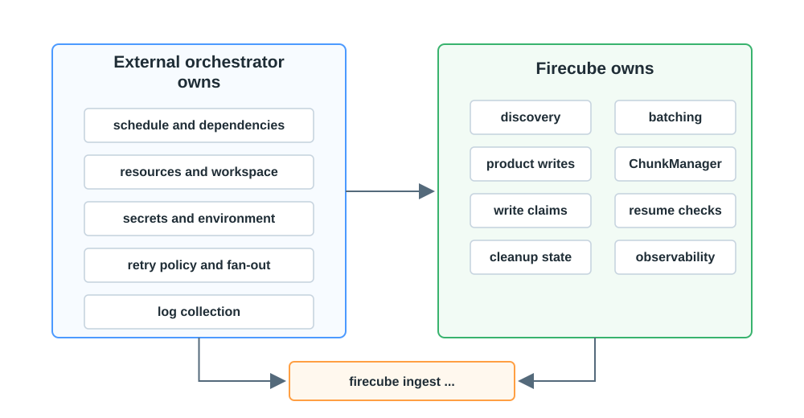

# Orchestrator Contract

The external orchestrator starts Firecube commands. Firecube runs ingestion and
protects the product while that command is active.

This boundary is what makes Firecube portable: you do not need a Firecube
scheduler integration. You need something outside Firecube that can start a CLI
command with the right environment, storage access, and resources.

<figure markdown="span">
  { width="860" }
  <figcaption markdown="span">The external orchestrator controls when and where commands start. Firecube controls what happens inside one ingestion command.</figcaption>
</figure>

## External Orchestrator Owns

- Starting the command at the right time.
- Passing CLI flags, config files, and environment variables.
- Injecting credentials without putting secrets on the command line.
- Providing CPU, memory, workspace, network, and storage access.
- Deciding retry policy after a command exits.
- Fan-out across independent products, groups, partitions, or slot ranges.
- Capturing logs and keeping command output available.

## Firecube Owns

- Source discovery inside the command.
- Batching and pipeline workers.
- Product writes through the selected storage driver.
- ChunkManager records for runs, spans, claims, snapshots, and cleanup state.
- Resume checks before writing.
- Write-safety checks for claims and direct-Zarr slot ranges.
- Metrics, logs, and traces emitted by the command.

## What Every Command Needs

Each `firecube ingest` command still needs the normal runtime inputs:

- plugin name
- source path or URI
- product URI target
- product name
- storage type and driver
- output format and write mode
- plugin-specific options, when required

Use [Run Ingestion](../../quickstart/ingestion.md) for runnable examples and
[CLI Reference](../../reference/cli.md) for the complete command surface.

## Next Steps

- **[Execution Shapes](execution-shapes.md)** — choose how the command is started
- **[Scheduling And Write Safety](write-safety.md)** — decide what can run in parallel
- **[Configuration Model](../configuration.md)** — check CLI, config file, and environment precedence
- **[Observability](../observability/index.md)** — connect logs, metrics, and traces to external orchestrator jobs
