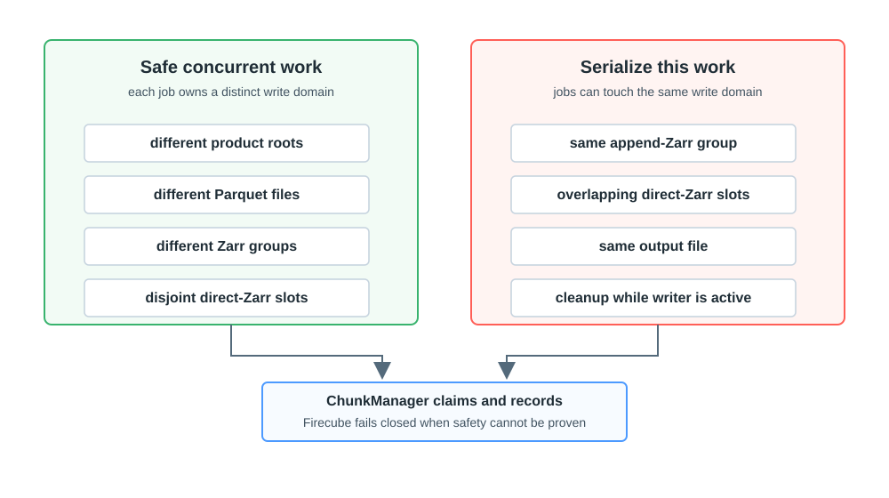

# Scheduling And Write Safety

The external orchestrator decides what starts at the same time. Firecube
enforces write safety inside each command with ChunkManager records and write
claims.

The scheduling question is always the same: do these commands write different
parts of the product, or can they touch the same write domain?

<figure markdown="span">
  { width="860" }
  <figcaption markdown="span">Concurrent work is safe only when each writer owns a distinct write domain. If the external orchestrator cannot prove that, serialize the commands.</figcaption>
</figure>

## Safe Concurrent Work

These can run concurrently when each job owns a distinct write domain:

- different product roots;
- different Parquet output files or partitions;
- different Zarr groups when the plugin and write strategy allow it;
- disjoint, chunk-aligned `DirectZarrIngestor` slot ranges.

## Work To Serialize

Run these sequentially:

- two append-Zarr writers mutating the same group;
- overlapping direct-Zarr slot ranges;
- two jobs writing the same output file;
- cleanup, claim clearing, or span deletion while a writer is still active.

For append-Zarr products, source dates alone do not prove safety. If two jobs
append to the same Zarr group, they still share the write domain.

## What Firecube Does

Firecube fails closed when it sees unsafe state. It blocks active conflicting
runs, rejects overlapping or chunk-misaligned direct-Zarr slot ranges, and
requires stale claims to be handled before work continues.

The external orchestrator still has to choose the schedule. When it cannot prove
jobs are disjoint, run them sequentially.

## Next Steps

- **[Parallelism](../parallelism.md)** — choose workers and write domains by plugin class
- **[Parallel Zarr Writes](../output-formats/zarr/parallel-writes.md)** — operate `DirectZarrIngestor` slot workers
- **[Recover Runs And Claims](../../operations/chunk-manager/recover.md)** — recover stuck runs or stale claims
- **[ChunkManager Operations](../../operations/chunk-manager/index.md)** — inspect runs, claims, spans, or snapshots
