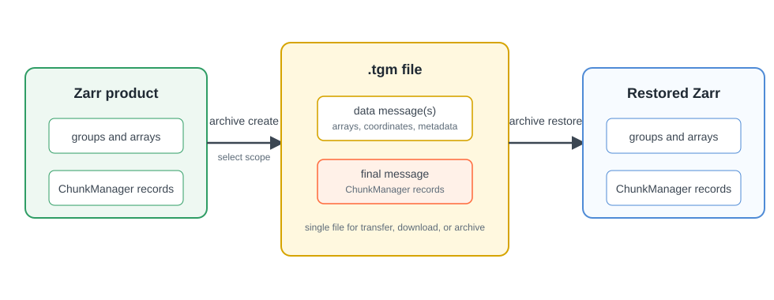

# Tensogram

Firecube uses [Tensogram](https://github.com/ecmwf/tensogram) to package
finished Zarr products as single `.tgm` files for transfer, download, archival
cold storage, and later restore back to Zarr.

Zarr remains the normal cube layout for ingestion and analysis. The `.tgm` file
is the package Firecube creates from an existing Zarr product.

For the commands, see **[Archive Operations](../../operations/archive/index.md)**.

<figure markdown="span">
  { width="820" }
  <figcaption markdown="span">Firecube packages selected Zarr data into `.tgm` messages and stores ChunkManager records as the final message, so restore keeps the cube lifecycle inspectable.</figcaption>
</figure>

## When To Use It

- Move a finished Zarr product or create archival cold storage:
  `firecube archive create` packages the product as one `.tgm` file.
- Share part of a multi-group product: pass `--group` to package one Zarr group.
- Download or transfer a smaller time slice: pass `--start-date` and
  `--end-date`.
- Package only the variables the recipient needs: pass `--variables`.
- Restore the package for normal cube access:
  `firecube archive restore` recreates a Zarr product.

## What To Know

- Install the Tensogram extra before using archive commands:
  `uv pip install 'firecube[tensogram]'`.
- `firecube archive info`, `list`, and `validate` inspect `.tgm` files without
  changing the product.
- For Firecube-generated Zarr products, ChunkManager records are packaged and
  restored with the data, so restored products can be inspected with
  ChunkManager operations.

## Open With Xarray

Consumers with `tensogram-xarray` installed can open `.tgm` files through
Xarray:

```python
import xarray as xr

ds = xr.open_dataset("product.tgm", engine="tensogram")
print(ds)
```

## Next Steps

- **[Archive Operations](../../operations/archive/index.md)** — create, inspect, validate, or restore `.tgm` files
- **[Create Archives](../../operations/archive/create.md)** — package a finished Zarr product as Tensogram
- **[Inspect And Validate Archives](../../operations/archive/inspect.md)** — inspect or validate `.tgm` contents
- **[Restore Archives](../../operations/archive/restore.md)** — restore a Tensogram file back to Zarr
- **[Zarr](zarr/index.md)** — understand the normal cube layout
