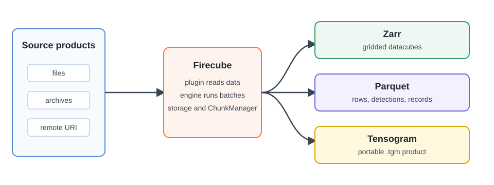

# Output Formats

Choose the output format from the product you want to build. Firecube can write
gridded datacubes as **Zarr**, tabular products as **Parquet**, and package
finished Zarr products as single **Tensogram** `.tgm` files.

The output format is separate from storage. The same product shape can be written
to a local `file://` target or an `s3://` target by changing the ingest flags.

<figure markdown="span">
  { width="820" }
  <figcaption markdown="span">Pick the output format from the product shape first; storage is a separate runtime choice.</figcaption>
</figure>

## Choose By Product Shape

| Your product is | Use | Why |
|---|---|---|
| A gridded datacube with dimensions such as time, latitude, longitude, channel, or forecast step | **[Zarr](zarr/index.md)** | Readers can open subsets of a large array product without downloading everything. |
| Rows, detections, point observations, or feature records | **[Parquet](parquet.md)** | Each batch can write independent columnar files that downstream tools can filter efficiently. |
| A finished Zarr product that needs to move as one file | **[Tensogram](archive.md)** | The product can be packaged as a `.tgm` file for transfer, download, or archival cold storage. |

## How The Choice Affects Firecube

| Format | Plugin path | Parallel behavior |
|---|---|---|
| Zarr append | `GenericZarrIngestor` | Source parsing can run in parallel; appends to one Zarr group are serialized. |
| Zarr direct region | `DirectZarrIngestor` | Disjoint regions can be written directly; slot workers can write the same group in parallel when the plugin opts in. |
| Parquet | `GenericParquetIngestor` | Batches write independent files, so pipeline workers can parallelize both preparation and writes. |
| Tensogram | Archive commands | Package a finished Zarr product as `.tgm`, then inspect, validate, or restore it back to Zarr. |

If you are building a plugin, choose the output format first, then choose the
matching plugin base class. If you are running an existing plugin, the plugin
documentation should tell you which `--output-format` and `--write-mode` to use.

## Next Steps

- **[Zarr](zarr/index.md)** — choose append or direct region writes for gridded arrays
- **[Parquet](parquet.md)** — write tabular records
- **[Tensogram](archive.md)** — package a finished product as `.tgm`
- **[Create a Plugin](../plugins/create-a-plugin.md)** — scaffold a plugin after choosing the product shape
- **[Performance Tuning](../performance.md)** — tune chunking, sharding, compression, and batch size
