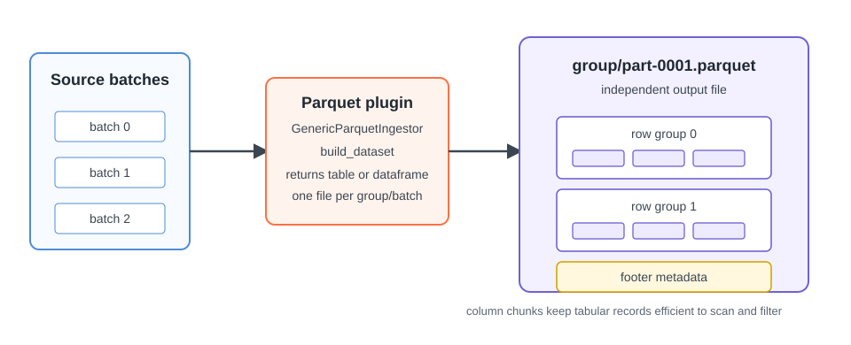

# Parquet

Parquet stores tabular data in a columnar format. Use it when the product is a
collection of rows rather than a multidimensional array.

<figure markdown="span">
  { width="820" }
  <figcaption markdown="span">Written batches are stored as independent Parquet parts below the dataset root.</figcaption>
</figure>

The Firecube target is a Parquet dataset root, not one output file. It contains
independent part files; parts for non-default groups use their own
subdirectories.

Readers should open the target as a Parquet dataset so the query engine can
combine the parts and select only the required columns.

## Write And Concurrency Model

Each group and batch writes its own part rather than appending to one shared
file. Pipeline workers can therefore prepare data and write distinct parts
concurrently. Non-default groups are separated below the dataset root so their
parts do not share paths.

This differs from sequential Zarr appends, where writes to one group must pass
through one writer. The tradeoff is that consumers must treat the Parquet target
as a dataset of parts and keep the table schema compatible across batches.

For plugin implementation, see
[GenericParquetIngestor](../../guides/plugins/generic-parquet.md).

## Next Steps

- **[GenericParquetIngestor](../../guides/plugins/generic-parquet.md)** — implement a Parquet plugin
- **[Parallelism](../parallelism.md)** — understand independent part-file writes
- **[Sentinel-3 FRP To Parquet](../../tutorials/sentinel3-frp.md)** — follow a Parquet plugin tutorial
