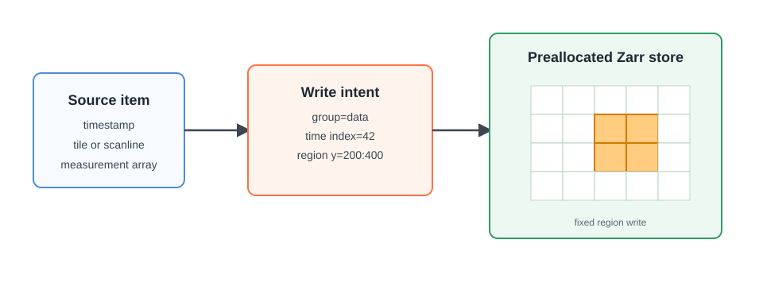
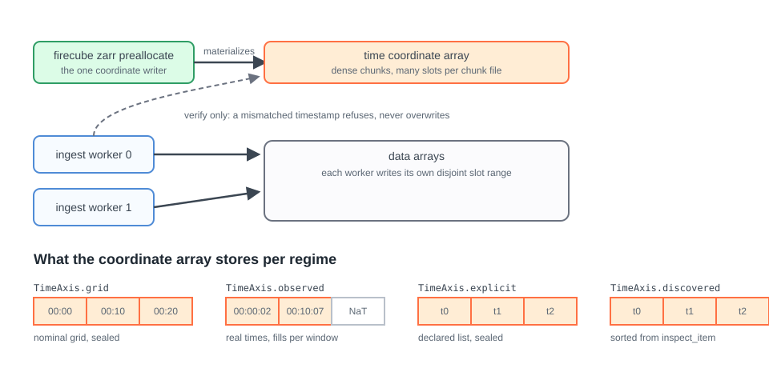

# DirectZarrIngestor (Region)

`DirectZarrIngestor` places data at absolute indexes in declared Zarr arrays.
It does not need the shared end-of-group cursor used by dataset appends. This
makes precise indexed writes possible and provides the foundation for several
processes to write disjoint ranges of one group.

Choose this model when the plugin needs explicit control over array placement
or when constructing a complete dataset for each batch is not a good fit. The
plugin emits write intents rather than returning an `xarray.Dataset`; Firecube
applies them through `zarr-python`.

## How Direct Writes Work

1. The plugin declares the product's time axis and its Zarr groups and arrays.
2. Firecube resolves the axis into a slot index, creates missing arrays or
   validates the existing schema, and materializes the coordinate values.
3. For each batch, the plugin returns write intents for specific arrays and
   indexes.
4. Firecube validates and applies those intents, then records the run.

<figure markdown="span">
  { width="820" }
  <figcaption markdown="span">Direct writes replace the append cursor with explicit indexed placement.</figcaption>
</figure>

## Schema And Write Intents

The schema defines each array's shape, chunks, dimensions, data type, and
attributes. A write intent then describes one write, built with the factory
matching its purpose:

| Factory | Purpose |
|---|---|
| `WriteIntent.region(...)` | Write a spatial slice at one indexed position in a rank-3 or rank-4 array. |
| `WriteIntent.slot(...)` | Write one complete indexed slot of an array. |
| `WriteIntent.coordinate(...)` | Write one indexed coordinate value. |
| `WriteIntent.static(...)` | Write a non-indexed array once and verify it on replay. |

The plugin owns the mapping from source data to those writes. Firecube owns
schema setup and validation, storage access, write coordination, and run
tracking.

## Time Axes And Coordinate Ownership

The declared time axis decides what the coordinate array stores and who
writes it. Declaring one is a single entry in `index_spec`:

```python
from firecube.ingestor.api import IndexSpec, TimeAxis

IndexSpec(
    name="my_product_v1",
    groups={
        "data": TimeAxis.observed(
            coordinate="timestamp",
            epoch="2024-01-01T00:00:00Z",
            cadence_s=600,
            end_date="2024-01-08T00:00:00Z",
        ),
    },
)
```

<figure markdown="span">
  { width="860" }
  <figcaption markdown="span">One writer for the coordinate array; workers verify. The strip shows the stored values per regime.</figcaption>
</figure>

One rule underpins parallel safety: the coordinate array has a
single writer, and it is never an ingestion worker. A dense coordinate keeps
hundreds of slots per physical chunk, so concurrent workers writing their own
timestamps would silently overwrite each other. Firecube therefore
materializes coordinate values up front, and workers only verify: a write
whose timestamp differs from the stored value is refused loudly, never
merged.

Each `TimeAxis` constructor commits the product to one regime:

- **Grid** ([`TimeAxis.grid`](../../../reference/parallelism.md#firecube.ingestor.api.TimeAxis.grid)): regular cadence and the nominal grid is the
  truth. Slot `n` stores exactly `epoch + n * cadence`, so the axis is filled
  and sealed without reading any source data. Worker timestamps must land
  exactly on the grid; any deviation is treated as corruption. Claim this
  only when the source guarantees exact slot times.
- **Observed** ([`TimeAxis.observed`](../../../reference/parallelism.md#firecube.ingestor.api.TimeAxis.observed)): regular cadence for placement, real
  observation times for storage. A ten-minute sensor rarely stamps files at
  the slot boundary; the observation arrives at `00:00:02` or `00:10:07`.
  Firecube floors each timestamp onto the cadence to find its slot while the
  coordinate array keeps the true time. Readers get honest timestamps and
  the planner still gets a regular grid. This is the regime most real
  products need. The axis stays open-ended: windows materialize as source
  data arrives, and re-runs reconcile per slot instead of failing or
  overwriting.
- **Explicit** ([`TimeAxis.explicit`](../../../reference/parallelism.md#firecube.ingestor.api.TimeAxis.explicit)): no regular cadence, but the full list
  of timestamps is known upfront. The declaration carries the values, so the
  axis is written and sealed like the grid regime.
- **Discovered** ([`TimeAxis.discovered`](../../../reference/parallelism.md#firecube.ingestor.api.TimeAxis.discovered)): the timestamps live inside the
  source files. This declares `IrregularTimeAxis(values=AUTO)`, the spelling
  the reference and error messages use. Firecube runs `inspect_item` over
  every item before any write, sorts the collected coordinates, and builds
  the axis from them. Discovery happens once and its result is handed to
  parallel workers by stable reference, which is why `inspect_item` must be
  idempotent, order-independent, and resolvable through references that stay
  valid for the cube's lifetime. Duplicate or missing coordinates are
  refused at discovery time.

The tradeoff runs along two lines. Regular beats irregular when you can
claim it: a regular axis lets Firecube plan slot ranges from the declaration
alone and lets rolling products extend indefinitely, while irregular axes
need the complete value set first. Within each pair, the earlier option is
stricter and the later more honest: grid enforces nominal times, observed
stores what the instrument measured; explicit trusts your list, discovered
trusts the data. Stricter regimes fail earlier and louder, which is what you
want whenever the guarantee genuinely holds.

To declare an axis, start from the routing table in the
[`DirectZarrIngestor` guide](../../../guides/plugins/direct-zarr.md#choose-the-time-axis); the exact constructor signatures are in
the [Index Specification Reference](../../../reference/parallelism.md#index-types).

All regimes share one failure philosophy: divergence between a stored value
and an incoming one raises a schema drift error naming the slot and both
values. Nothing is overwritten, and an interrupted run re-runs with the same
input; matching values are no-ops and missing values are filled.

## Serial Store Growth

A serial direct-write store does not need a known final indexed extent. An
indexed array may begin at length zero, and Firecube grows it when an intent
targets a later index. Static arrays are created at their declared shape.

A fixed, preallocated global extent is required only when the plugin opts into
slot-range parallelism; see [Parallel Zarr Writes](parallel-writes.md) for
that safety model.

## When To Use It

Use `DirectZarrIngestor` when explicit array placement is part of the product
contract, including sparse regions, indexed coordinate writes, or static arrays
that accompany indexed data, and always when you need slot-range parallel
ingestion. If the plugin can return complete, compatible `xarray.Dataset`
batches and serial appends suffice,
[GenericZarrIngestor (Append)](generic-append.md) provides a smaller authoring
surface.

## Next Steps

- **[`DirectZarrIngestor` Guide](../../../guides/plugins/direct-zarr.md)** —
  implement the axis, schema, and write-intent hooks
- **[Parallel Zarr Writes](parallel-writes.md)** — understand the slot-range
  safety model
- **[GenericZarrIngestor (Append)](generic-append.md)** — compare the complete
  dataset contract
- **[DirectZarrIngestor (Region) Tutorial](../../../tutorials/direct-zarr-parallel.md)** —
  build and run a slot-capable plugin
