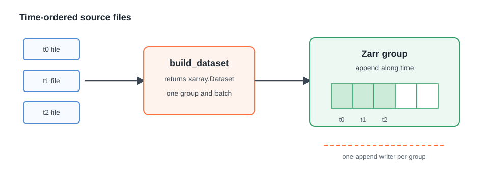
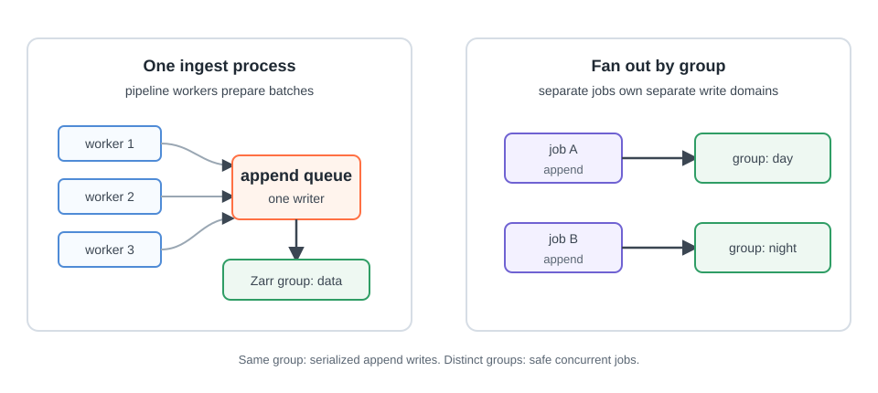

# GenericZarrIngestor (Append)

Use `GenericZarrIngestor` when your source products naturally become
time-ordered `xarray.Dataset` batches. This is the default Zarr path and the
right starting point for most gridded products.

## User Story

You have files that arrive in chronological order. For each batch, your plugin
reads the measurements, builds an `xarray.Dataset`, and hands it back to
Firecube. Firecube writes the dataset into the Zarr store, appends along the time
axis, records what happened in ChunkManager, and moves on to the next batch.

<figure markdown="span">
  { width="820" }
  <figcaption markdown="span">Append is the simple path: each batch becomes an `xarray.Dataset`, then Firecube appends it to the group in order.</figcaption>
</figure>

## What The Plugin Provides

The plugin implements `build_dataset(group, items, ctx)` and returns an
`xarray.Dataset` for that group and batch. Firecube handles the surrounding
work: source discovery, batching, storage access, write claims, run records,
metrics, logs, and traces.

For the plugin hook surface, see
[GenericZarrIngestor](../../plugins/generic-zarr.md).

## When To Use It

- Source files can be processed in order.
- Each batch represents new data to append along time.
- Coordinate alignment should be handled by Firecube.
- You want the smallest plugin surface for a gridded Zarr product.

## Parallelism Model

Append writes are safe because Firecube treats a Zarr group as a shared write
domain. Within one run, `pipeline_workers` can prepare batches in parallel, but
Firecube still writes one append at a time for the group.

<figure markdown="span">
  { width="820" }
  <figcaption markdown="span">Pipeline workers can prepare append batches in parallel. Appends to one group are serialized; distinct Zarr groups can be ingested concurrently as separate write domains.</figcaption>
</figure>

To scale append-Zarr ingestion safely:

- use pipeline workers when parsing or transformation is the bottleneck;
- fan out across different products or different Zarr groups;
- do not run two append writers against the same group.

If one group needs true concurrent writes, use
[DirectZarrIngestor (Region)](direct-region.md) instead.

## When To Move To Direct Region Writes

Use direct region writes when source items arrive out of order, you need to fill
sparse slices, you already know the full store shape, or one group needs many
workers writing disjoint ranges.

## Next Steps

- **[DirectZarrIngestor (Region)](direct-region.md)** — high-throughput, sparse, or out-of-order writes
- **[GenericZarrIngestor](../../plugins/generic-zarr.md)** — implement the append-Zarr plugin hook
- **[Weather CSV Plugin](../../../tutorials/weather-csv.md)** — build a working `GenericZarrIngestor` plugin
- **[Performance Tuning](../../performance.md)** — batch-size alignment, sharding, compression, and Dask scheduler tuning
