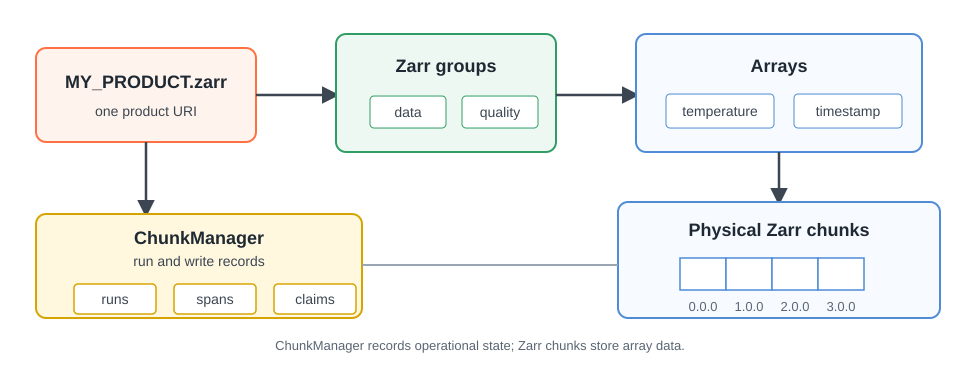

# Zarr

Use Zarr for gridded datacubes: N-dimensional arrays over axes such as time,
latitude, longitude, channel, forecast step, or another product-specific
dimension.

In Firecube, the plugin shapes the data, while the engine handles discovery,
batching, storage, write coordination, validation, and recovery state.

<figure markdown="span">
  { width="820" }
  <figcaption markdown="span">A Firecube Zarr product keeps array data in Zarr groups and physical chunks. ChunkManager keeps run, span, and claim records beside the store.</figcaption>
</figure>

After choosing Zarr, the next key decision is the write strategy: whether to
append `xarray.Dataset` batches sequentially, or write directly to fixed Zarr
regions using `zarr-python`.

## Choose A Zarr Write Path

| If your source data... | Start with | Why |
|---|---|---|
| Arrives in order and each batch can become an `xarray.Dataset` | **[GenericZarrIngestor (Append)](generic-append.md)** | Firecube aligns coordinates and appends along time for you. |
| Can be split into independent Zarr groups | **[GenericZarrIngestor (Append)](generic-append.md)** with one job per group | Append writes are serialized per group, but distinct groups are separate write domains. |
| Arrives out of order, covers sparse slices, or maps to fixed time/grid slots | **[DirectZarrIngestor (Region)](direct-region.md)** | The plugin declares the store layout and writes exact regions. |
| Needs many workers writing the same Zarr group | **[DirectZarrIngestor (Region)](direct-region.md)**, then **[Parallel Zarr Writes](parallel-writes.md)** | Slot workers need fixed, disjoint, chunk-aligned ranges. |

Start with append unless the data forces direct region writes. Direct region
writes are more powerful, but the plugin has to know the final layout and map
source items to exact indexes. If one Zarr group itself needs concurrent
writers, use `DirectZarrIngestor`.

## What Firecube Keeps Safe

- Firecube records run history, spans, and write claims in ChunkManager.
- Use `firecube chunks` to inspect and recover that state.
- Firecube ChunkManager records are not physical Zarr chunks. Zarr chunks are
  array storage units; Firecube records are operational metadata about what a run
  wrote.
- Storage location is still explicit. Use a full `file://` or `s3://` target and
  pass `--storage-type`, `--storage-driver`, and `--write-mode`.

## Next Steps

- **[GenericZarrIngestor (Append)](generic-append.md)** — append `xarray.Dataset` batches in time order
- **[DirectZarrIngestor (Region)](direct-region.md)** — write fixed regions or sparse slices
- **[Parallel Zarr Writes](parallel-writes.md)** — run many direct-Zarr workers against the same group
- **[Create a Plugin](../../plugins/create-a-plugin.md)** — scaffold a plugin and choose a base class
- **[Performance Tuning](../../performance.md)** — tune chunking, sharding, compression, and batch size
