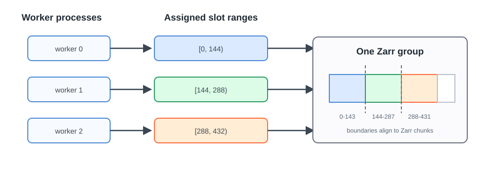

# Parallel Zarr Writes

Parallel Zarr writes are an optional capability of `DirectZarrIngestor`. They
allow several worker processes to write one Zarr group by assigning each worker
a disjoint range on the product's indexed dimension.

This model is for a fixed global layout with deterministic index placement. It
is not a separate plugin class, and it does not apply to
`GenericZarrIngestor` appends.

<figure markdown="span">
  { width="820" }
  <figcaption markdown="span">Each worker owns a half-open index range. Range boundaries align with physical chunks so workers do not share a chunk.</figcaption>
</figure>

## How This Removes The Append Bottleneck

An append writer finds the next position from the current group length, so
concurrent appenders must be serialized. Slot workers avoid the shared cursor
entirely: the complete indexed extent is created first (the
[direct write model](direct-region.md) explains how the declared time axis
makes that possible), the slot planner produces disjoint ranges aligned with
the physical chunks of every time-indexed array, and an external scheduler
passes one range to each ingest process. Firecube validates each range before
writing.

This is optional. A normal `DirectZarrIngestor` run remains serial unless the
plugin declares the index spec and the processes are launched with assigned
ranges.

## Why Slots Are Needed

Concurrent writes are safe only when workers cannot modify the same physical
Zarr chunk. Firecube expresses that ownership as half-open slot ranges: a worker
owns its start index and every index up to, but not including, its end index.

The same slot plan applies to every time-indexed array in the group. An intent
outside the worker's assigned range fails before the write is applied.

## Why Chunk Alignment Matters

Zarr stores several logical indexes in one physical chunk when the indexed
chunk size is greater than one. Two ranges that are disjoint at the index level
can still share a physical chunk. Firecube therefore requires slot boundaries
to align with the indexed chunk layout of every writable array.

## What The Plugin Must Know

A plugin must provide:

- the fixed global indexed extent for each writable group;
- one deterministic mapping from coordinate values to integer indexes;
- the indexed axes and chunk alignment rules for the product; and
- write intents that remain inside the worker's assigned range.

These requirements are additional to the normal `DirectZarrIngestor` schema
and write-intent contract. The
[`DirectZarrIngestor` guide](../../../guides/plugins/direct-zarr.md#implement-the-plugin)
lists the public hooks.

## What Firecube Coordinates

Firecube creates or validates the shared schema, plans ranges, rejects unsafe
boundaries, checks emitted intents, and records worker claims and completed
coverage. Resume-aware planning can exclude ranges already recorded as
complete.

An external scheduler still starts and supervises the worker processes.
Firecube coordinates their storage ownership; it does not replace the
scheduler.

## Limits

- The global indexed extent and schema must remain fixed for the parallel run.
- Every worker must use the same coordinate-to-index mapping.
- Slot boundaries must align with the physical chunks of all indexed arrays.
- Workers may write the same group only through their assigned ranges.
- Schema changes during the parallel run are not supported.

## Next Steps

- **[Run Parallel Zarr Writes](../../../operations/parallel-zarr-writes.md)** -
  preallocate, plan, launch, verify, and recover workers
- **[`DirectZarrIngestor` Guide](../../../guides/plugins/direct-zarr.md#implement-the-plugin)** -
  implement the index contract and write-intent hooks
- **[DirectZarrIngestor (Region) Tutorial](../../../tutorials/direct-zarr-parallel.md)** -
  build a complete parallel example
- **[Benchmarks](../../benchmarks.md#same-group-slot-scaling)** - review one
  measured slot-scaling workload
- **[Parallelism](../../parallelism.md)** - compare concurrency across Firecube
  output formats
