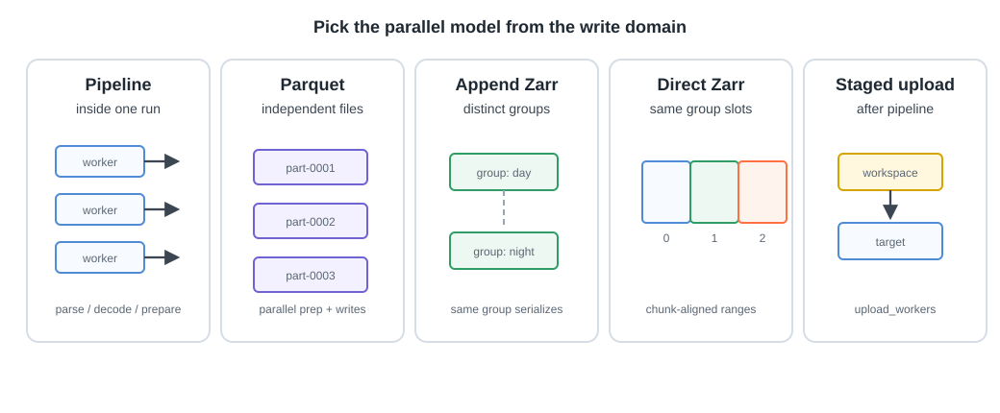

# Parallelism

Firecube supports multiple kinds of parallelism. They are not interchangeable.
Choose the model from the plugin class and the part of the product each worker
writes.

<figure markdown="span">
  { width="900" }
  <figcaption markdown="span">Each model owns a different write domain. Pick workers from the output format, not from CPU count alone.</figcaption>
</figure>

## Start With Your Plugin Class

`GenericParquetIngestor` can use pipeline workers for preparation and writes.
Each batch writes an independent Parquet file, so workers do not share one
mutable output file.

`GenericZarrIngestor` can use pipeline workers for source preparation. Appends
to one Zarr group are serialized. Separate jobs can run safely only when they
target disjoint products or disjoint Zarr groups.

`DirectZarrIngestor` declares Zarr arrays and emits explicit writes to them.
Slot workers can write the same Zarr group only when the plugin opts in and each
worker owns a disjoint, chunk-aligned slot range.

Staged upload parallelism is separate. `upload_workers` controls the upload
phase after staged pipeline writes have completed.

## Which Worker Option Is Which

Every worker option is an engine option, follows the same `<stage>_workers`
naming, and controls exactly one pipeline stage:

| Option | Stage it parallelizes | Default |
|---|---|---|
| `pipeline_workers` | Whole batches preprocessing concurrently inside one process. 2 or more runs the parallel pipeline; 1 runs sequentially. | 1 |
| `extract_workers` | Source archives (for example ZIPs) unpacking concurrently inside one batch, before decoding. Independent of `pipeline_workers`; when both are above 1 they multiply. | 4 |
| `upload_workers` | Staged output files uploading concurrently after the pipeline completes. | 4 |

All three are passed the same way: `--option <name>=N`.

## Supported Models

**Pipeline workers** run inside one `firecube ingest` process. Use them for
source parsing, decoding, transformation, and batch preparation.

```bash
--option pipeline_workers=4
```

`pipeline_workers` alone decides the mode: 2 or more runs the parallel
pipeline, 1 (the default) runs batches sequentially.

**Parquet file parallelism** uses pipeline workers to write independent files.
This is the simplest parallel write model.

**Append-Zarr group fan-out** runs separate jobs for separate Zarr groups or
separate products. Do not run two append writers against the same group.

**Direct-Zarr slot parallelism** runs multiple `firecube ingest` processes
against one Zarr group. This is only for `DirectZarrIngestor` plugins with
slot-range support.

**Staged upload workers** upload staged files to the final target after the
pipeline is done.

```bash
--option upload_workers=8
```

## Safe Write Domains

A write domain is the physical part of the product one writer owns while it
writes. Firecube records write claims in ChunkManager, but the safe domain still
depends on output format:

- Parquet: one writer per output file path.
- `GenericZarrIngestor`: one append writer per Zarr group.
- `DirectZarrIngestor` slots: one writer per disjoint, chunk-aligned range.
- Tensogram packaging: one writer per `.tgm` output.

For append-Zarr products, splitting source files by date is not enough if both
jobs append to the same Zarr group. The group metadata is still shared.

## Common Mistakes

- Expecting `pipeline_workers` to make append-Zarr writes concurrent.
- Running two `GenericZarrIngestor` jobs against the same group.
- Using slot flags with `GenericZarrIngestor` or `GenericParquetIngestor`.
- Increasing worker count before checking whether upload or storage is the
  bottleneck.
- Clearing runs or claims before verifying no writer is still active.

Firecube fails closed when parallel writes cannot be proven safe. Use
[ChunkManager Operations](../operations/chunk-manager/index.md) for recovery
commands.

## Next Steps

- **[Performance Tuning](performance.md)** — decide whether workers, staged mode, sharding, or upload tuning helps
- **[GenericZarrIngestor](../guides/plugins/generic-zarr.md)** — implement serialized Zarr appends
- **[Parquet](output-formats/parquet.md)** — write tabular outputs with parallel batch files
- **[Run Parallel Zarr Writes](../operations/parallel-zarr-writes.md)** — operate `DirectZarrIngestor` slot workers
- **[Orchestration](orchestration.md)** — schedule multiple Firecube jobs
