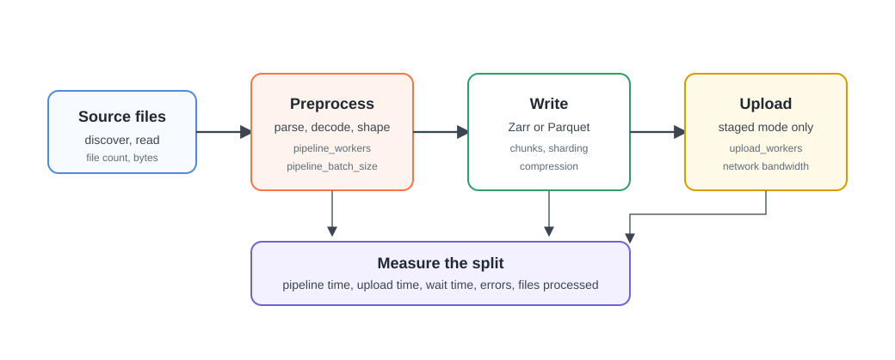

# Performance Tuning

Start by finding the bottleneck. Firecube tuning is usually straightforward once
you know whether time is going into preprocessing, writes, staged upload,
validation, or memory pressure.

For safe concurrency models, see [Parallelism](parallelism.md). For measured
workload examples, see [Benchmarks](benchmarks.md).

<figure markdown="span">
  { width="860" }
  <figcaption markdown="span">Tune the phase that dominates the run. More workers only help when they target the bottleneck.</figcaption>
</figure>

## Measure First

Run a representative source window, then compare:

- total run duration;
- pipeline duration;
- staged upload duration;
- non-CPU wait time;
- files processed;
- storage errors;
- failed batches.

Firecube pushes these as end-of-run metrics when Pushgateway is configured. See
[Metrics](observability/metrics.md) for the model and
[Observability Reference](../reference/observability.md) for metric names.

## If Preprocessing Is Slow

Preprocessing includes source discovery, parsing, decompression, transformation,
and shaping batches before the write step.

Use pipeline workers when this phase dominates:

```bash
--option pipeline_workers=4
```

`pipeline_workers` alone decides the mode: 2 or more runs the parallel
pipeline, 1 (the default) runs batches sequentially.

Increase workers gradually. If CPU usage is already high, more workers may add
contention without improving throughput. If memory grows too much, reduce
`pipeline_batch_size` or worker count.

## If Zarr Writes Are Slow

For `GenericZarrIngestor`, source preparation can run in parallel but appends to
one Zarr group are serialized. More `pipeline_workers` will not make one append
writer concurrent.

Start with these checks:

- align `pipeline_batch_size` with the Zarr time chunk size;
- use `--write-mode staged` when S3 direct writes are dominated by per-chunk
  round trips and you have enough local scratch space;
- use Zarr sharding when large grids create too many small objects;
- choose compression from the bottleneck: disable it when CPU is the bottleneck,
  enable it when upload size is the bottleneck;
- prefer `dask_scheduler=synchronous` when pipeline workers are already active,
  so dask does not add another competing thread pool.

For the Zarr product model, see [Zarr](output-formats/zarr/index.md). For
the same-group concurrency model, see
[Parallel Zarr Writes](output-formats/zarr/parallel-writes.md). To execute that
model, use [Run Parallel Zarr Writes](../operations/parallel-zarr-writes.md).

## Parquet Tuning

When Parquet writes are slow, start with the file layout. Parquet batches write
independent files, so `GenericParquetIngestor` can benefit from pipeline workers
during both preparation and file writes.

Use larger batches when you are producing too many tiny files. The default
writer does not currently apply partition-column or row-group-size options;
plugins with those requirements must override `output_relpath()` or
`write_parquet()` and measure the resulting reader behavior.

## If Staged Upload Is Slow

Staged mode writes to a local workspace first, then uploads to the final target
after the pipeline completes. If upload duration dominates, tune upload
parallelism before changing pipeline workers:

```bash
--option upload_workers=8
```

Also check network bandwidth, object-store throttling, object count, and local
workspace speed. For large Zarr products, sharding can reduce object count and
make uploads less chatty.

## If Validation Is Slow

`firecube zarr validate` can be expensive on stores with many chunks. Use a
budget when you need a bounded check:

```bash
uv run firecube zarr validate \
  --product file:///data/products/MY_PRODUCT.zarr \
  --group MY_GROUP \
  --max-chunks 10000 \
  --on-timeout warn
```

Use `--on-timeout fail` for CI or post-ingest gates that must fail when the
validation budget is exceeded.

The JSON report includes `static_marker_failures`. An empty list means the
validated array either moves with the time axis or carries the
`firecube_static_written` marker. A non-empty list after a parallel run means
the static-owner worker did not finish its static writes: re-run the owner's
slot range, then validate again. Arrays whose first dimension is `timestamp`,
`time`, or `firecube_timestamp_state` never require the marker.

## If Memory Is Tight

Memory pressure usually comes from batch size, worker count, source decoding, or
compression. Reduce the shape of in-flight work first:

- lower `pipeline_batch_size`;
- lower `pipeline_workers`;
- avoid unnecessary compression when CPU and memory are tight;
- use a fixed workspace path with enough disk when staged writes are enabled.

Do not tune memory by guessing. Run a smaller source window and scale one setting
at a time.

## Common Starting Points

For a large gridded Zarr product on S3 with scratch space:

```bash
--write-mode staged \
--option dask_scheduler=synchronous \
--option zarr_sharding=true \
--option pipeline_batch_size=10 \
--option upload_workers=4
```

For CPU-heavy source parsing:

```bash
--option pipeline_workers=4 \
--option pipeline_batch_size=40
```

For tabular Parquet output:

```bash
--output-format parquet \
--option pipeline_workers=4 \
--option pipeline_batch_size=50
```

## Next Steps

- **[Benchmarks](benchmarks.md)** — compare measured workload profiles
- **[Parallelism](parallelism.md)** — choose safe concurrency
- **[Metrics](observability/metrics.md)** — inspect timing and throughput signals
- **[Zarr](output-formats/zarr/index.md)** — understand the persisted Zarr layout
- **[Observability Reference](../reference/observability.md)** — complete metric names and environment variables
