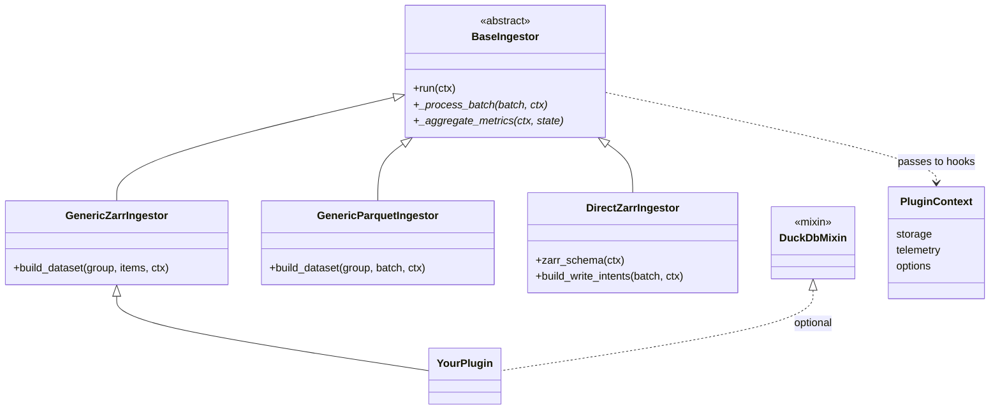

# BaseIngestor

`BaseIngestor` is the **foundation every plugin is built on**. The templates you
normally use — [GenericZarrIngestor](generic-zarr.md), [GenericParquetIngestor](generic-parquet.md),
and [DirectZarrIngestor](direct-zarr.md) — are all `BaseIngestor` subclasses. It defines
the engine contract and owns the `run()` lifecycle; each template fills that
lifecycle in with batteries (file discovery, batching, a write strategy) and
exposes a smaller, friendlier hook in place of the raw ones.

You subclass `BaseIngestor` **directly** only when none of the templates fit and
you want to own batch processing yourself. Scaffold one with
`firecube plugins create my-plugin --template base` (see
[Create a Plugin](create-a-plugin.md)).

## How the pieces fit



A concrete plugin extends one template (or `BaseIngestor` directly), optionally
mixes in a helper (see [Mixins](mixins.md)), and receives a read-only
`PluginContext` in every hook. The three `Generic*` templates also share batch-lifecycle hooks
(`batch_setup`, `prepare_batch_data`, `cleanup_batch_data`, `batch_teardown`);
`DirectZarrIngestor` dispatches `WriteIntent`s instead.

## What the engine runs

When a run starts, `BaseIngestor.run()` drives the whole pipeline and calls *your*
code at two points. Around your hooks it:

1. validates and merges the [configuration tiers](../configuration.md#option-tiers),
2. discovers and batches the source files,
3. opens [telemetry](../observability/index.md) and acquires the ChunkManager
   write claims,
4. calls **`_process_batch`** once per batch — *your code*,
5. calls **`_aggregate_metrics`** to roll per-batch metrics into the run result — *your code*,
6. records the run's outcome so it is idempotent and resumable.

The templates implement steps 4–5 for you (delegating to `build_dataset` /
`build_write_intents`); a direct `BaseIngestor` subclass implements them itself.

## Required hooks

| Hook | Signature | Purpose |
| :--- | :--- | :--- |
| **`_process_batch`** | `(batch, ctx) -> PipelineResult` | Process one batch and return a typed result. |
| **`_aggregate_metrics`** | `(ctx, state) -> Mapping[str, Any]` | Roll per-batch metrics into the run result. |

For the standard aggregation behavior, call `merge_batch_metrics(ctx, state)`
from `firecube.ingestor.api`.

## Context contract

- Plugin-facing hooks receive a read-only `PluginContext`.
- Runtime finalization hooks receive the engine-owned runtime context.
- Legacy `ctx: IngestContext` annotations are rejected at runtime with a
  `ConfigurationError`.

## Minimal example

```python
from collections.abc import Mapping
from typing import Any, ClassVar

from firecube.ingestor.api import (
    BaseIngestor,
    OutputPaths,
    PipelineBatch,
    PipelineResult,
    PluginContext,
    merge_batch_metrics,
    register_ingestor,
)


@register_ingestor("my_custom_plugin")
class MyCustomIngestor(BaseIngestor):
    PRODUCT_NAME: ClassVar[str] = "my_custom_product"
    name = "my_custom_plugin"

    def _process_batch(
        self,
        batch: PipelineBatch,
        ctx: PluginContext,
    ) -> PipelineResult:
        ...
        return PipelineResult(
            batch=batch,
            success=True,
            outputs=OutputPaths(primary=str(ctx.target)),
        )

    def _aggregate_metrics(self, ctx, state) -> Mapping[str, Any]:
        return merge_batch_metrics(ctx, state)
```

## Next Steps

- **[Plugin Contract](contract.md)** — check `PRODUCT_NAME`, typed outputs, and metric requirements
- **[GenericZarrIngestor](generic-zarr.md)** — use the append-Zarr template
- **[GenericParquetIngestor](generic-parquet.md)** — use the Parquet template
- **[DirectZarrIngestor](direct-zarr.md)** — write fixed Zarr regions
