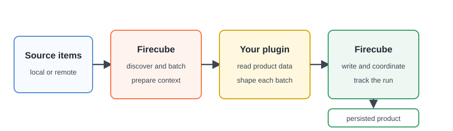

# Plugin Development Overview

A Firecube plugin is a Python package that teaches Firecube how to turn source
data into a product. Most plugins contain the product-specific reading and data
shaping, while a Firecube template provides source discovery, batching,
standard storage writes, run tracking, and recovery around that code.

## How Template Plugins Work

<figure markdown="span">
  { width="900" }
  <figcaption markdown="span">With a template class, the plugin supplies the product-specific conversion and Firecube manages the surrounding ingestion workflow.</figcaption>
</figure>

Most plugin authors use one of the three template classes. A template keeps the
plugin focused on product data while Firecube uses its standard writer. A
custom pipeline is available when none of those contracts represents the
product.

## Choose What Your Plugin Produces

| Product contract | Start with | Your plugin supplies |
|---|---|---|
| Complete, ordered multidimensional datasets | [`GenericZarrIngestor` (Append)](generic-zarr.md) | One `xarray.Dataset` for each group and batch; Firecube serializes appends to a group |
| Tables or data frames | [`GenericParquetIngestor` (Tabular)](generic-parquet.md) | One table or data frame for each group and batch |
| Zarr data with known indexed positions, especially when several workers must write one group | [`DirectZarrIngestor` (Region)](direct-zarr.md) | The array schema and write locations; for parallel workers, a fixed extent and deterministic index model |
| A product no template represents | [Custom Pipeline Plugins](base-ingestor.md), advanced | Processing, writing, results, and coordination |

The source file format does not determine the class. Choose the contract that
matches the data your plugin can supply.

For Zarr, the important difference is how a write position is chosen.
`GenericZarrIngestor` finds the end of the group and appends the next complete
dataset, so mutations to that group pass through one serialized append path.
`DirectZarrIngestor` places writes at indexes supplied by the plugin. Its
optional parallel contract fixes the global extent first, then lets separate
ingest processes own disjoint, chunk-aligned ranges of the same group.

Choose `DirectZarrIngestor` only when exact placement or same-group slot
parallelism justifies the additional schema and indexing work. The class also
supports serial ingestion; selecting it does not enable parallel writes by
itself. Compare the [Zarr write models](../../concepts/output-formats/zarr/index.md)
before implementing the plugin.

## From An Idea To A First Run

1. **Choose the product contract.** Use the table above to identify the public
   class that matches the data the plugin will supply.
2. **[Create the plugin](create-a-plugin.md).** The interactive command creates
   a Python package for the selected class.
3. **[Install the plugin](install-a-plugin.md).** Install it in development mode
   so Firecube can discover it while you edit the code.
4. **Implement the template hooks.** Follow the class guide linked from the
   table.
5. **Verify plugin discovery.** Inspect the registered plugin and its available
   configuration.
6. **Run ingestion.** Give the plugin source data and a product target, then
   verify the persisted output.

Add source access, configuration, and telemetry after the plugin is installed
and its main data-conversion method is working.

## Next Steps

- **[Create a Plugin](create-a-plugin.md)** — create a package with the
  interactive command
- **[Zarr Write Models](../../concepts/output-formats/zarr/index.md)** — compare
  sequential appends, direct writes, and optional parallel writes
- **[API Reference](../../reference/index.md)** — look up the public types
  used by template plugins
