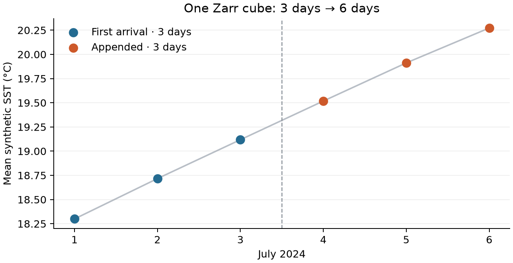
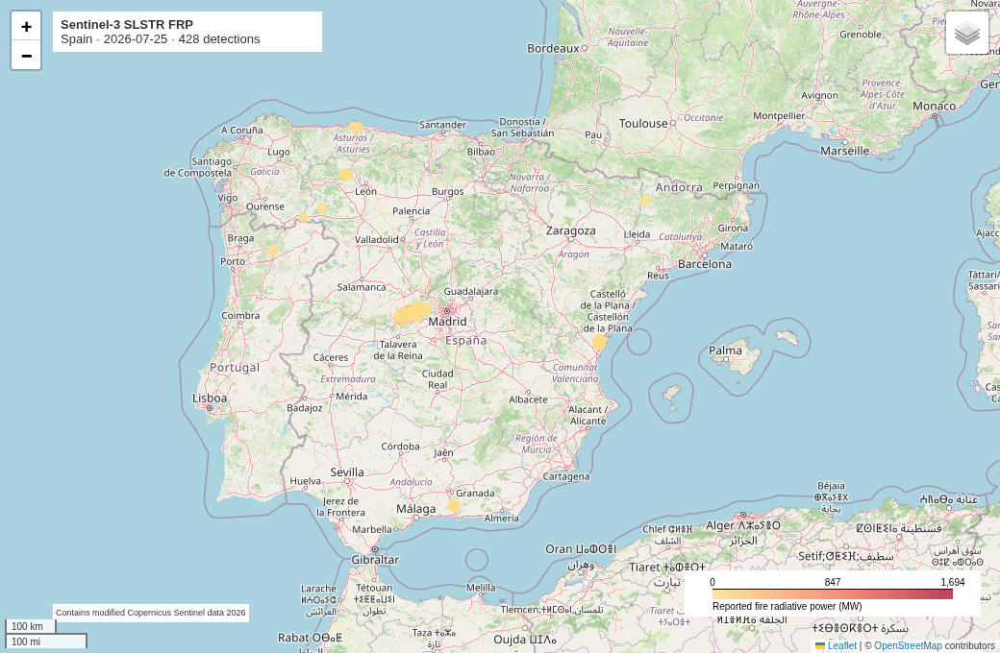
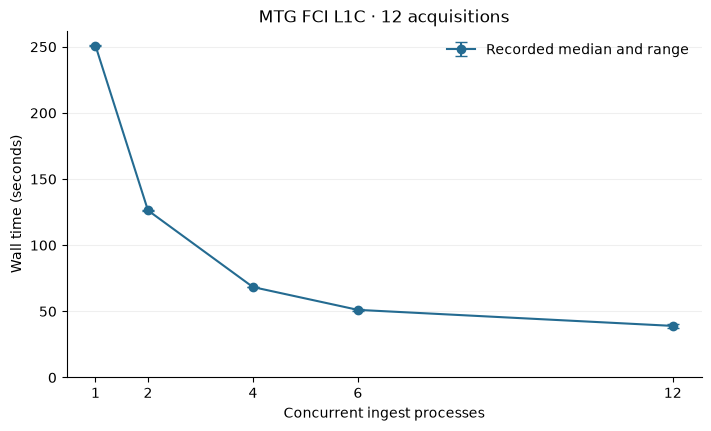

---
hide:
  - toc
  - navigation
---

# Showcase

Explore what you can build with Firecube.

**New to Firecube?** [Quickstart](../quickstart/index.md) runs an installed plugin.
**Building your own?** [Plugin Development](../guides/plugins/index.md) covers individual authoring tasks.

Beginner notebook · Generated data

## Firecube 101: NetCDF To Zarr

Create a cube from three days of data, append the next three, and check that
retrying an arrival adds no duplicates. Small files, no credentials.

[Open the notebook](netcdf-to-zarr.ipynb){ .md-button .md-button--primary }
<a class="md-button notebook-download" href="netcdf-to-zarr/netcdf-to-zarr.ipynb" download><svg viewBox="0 0 24 24" aria-hidden="true"><path d="M19 9h-4V3H9v6H5l7 7 7-7zM5 18v3h14v-3H5z"/></svg>Download notebook</a>

Two arrivals · One cube · Six unique days

Featured notebook · Real satellite data

## Sentinel-3 SLSTR Level 2 Fire Radiative Power

Explore thermal detections around Spain in July 2026. Download the standard
MWIR tables, write Parquet with Firecube, and compare days on an interactive map.

[Open the notebook](sentinel3-fire-detections.ipynb){ .md-button .md-button--primary }
<a class="md-button notebook-download" href="sentinel3-fire-detections/sentinel3-fire-detections.ipynb" download><svg viewBox="0 0 24 24" aria-hidden="true"><path d="M19 9h-4V3H9v6H5l7 7 7-7zM5 18v3h14v-3H5z"/></svg>Download notebook</a>

25 July 2026 · Colour shows fire radiative power

Benchmark notebook · Recorded runs

## Slot-Based Parallelism: MTG FCI L1C

Ingest two hours of FCI observations with the public plugin. Reproduce the
tuned parallel setup and compare your timings with recorded runs of about
39 seconds for twelve acquisitions.

[Open the notebook](mtg-fci-l1c-benchmarks.ipynb){ .md-button .md-button--primary }
<a class="md-button notebook-download" href="mtg-fci-l1c-benchmarks/mtg-fci-l1c-benchmarks.ipynb" download><svg viewBox="0 0 24 24" aria-hidden="true"><path d="M19 9h-4V3H9v6H5l7 7 7-7zM5 18v3h14v-3H5z"/></svg>Download notebook</a>

12 acquisitions · One ARM host · Local Zarr writes

