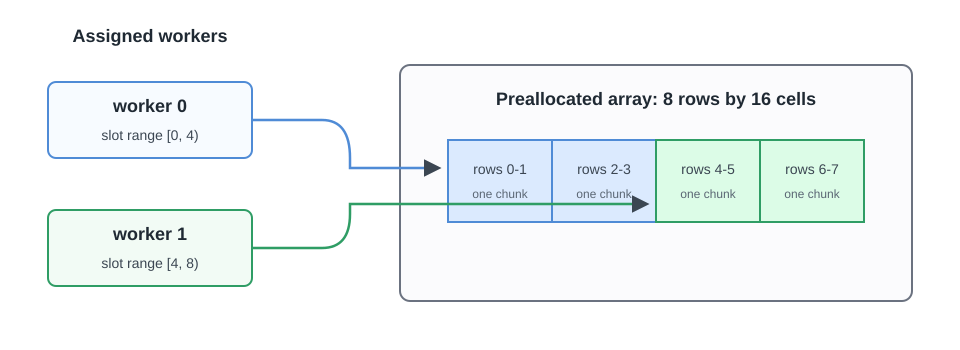

# Parallel DirectZarrIngestor

## Goal

Write disjoint time ranges into one Zarr store with `DirectZarrIngestor`.

This is the advanced Zarr path. Use it when each source item already knows its
global time index and workers can safely write separate slot ranges. For ordinary
time-ordered datasets, use `GenericZarrIngestor` instead.

<figure markdown="span">
  { width="900" }
  <figcaption markdown="span">Each slot range contains complete physical chunks, so the workers never modify the same chunk.</figcaption>
</figure>

Preallocation creates the complete array before either worker writes. The slot
plan assigns the half-open ranges `[0, 4)` and `[4, 8)`. Because the array uses
two rows per physical Zarr chunk, each worker owns two complete chunks and the
workers never modify the same chunk.

## Prerequisites

- Firecube installed. Start with [Installation](../quickstart/installation.md).
- Run every command below in the same Python environment where Firecube is
  installed.

If this is your first Firecube plugin, complete
[NetCDF To Zarr](weather-netcdf.md) first. This tutorial assumes you already
know how plugin creation, installation, and ingestion commands work.

## 1. Create Tiny Grid Files

Each `.npy` file represents one timestamp. The file name contains the global
time index. The plugin writes each small grid as one flattened Zarr row so the
parallel-write mechanics stay visible.

```bash
mkdir -p tutorial-data/grid-parallel
uv run python - <<'PY'
from pathlib import Path

import numpy as np

out = Path("tutorial-data/grid-parallel")
out.mkdir(parents=True, exist_ok=True)

for ts_index in range(8):
    data = np.full((4, 4), float(ts_index), dtype="float32")
    np.save(out / f"grid_{ts_index:03d}.npy", data)
PY
```

Check that the eight input files exist:

```bash
ls tutorial-data/grid-parallel
```

Expected output:

```text
grid_000.npy  grid_001.npy  grid_002.npy  grid_003.npy
grid_004.npy  grid_005.npy  grid_006.npy  grid_007.npy
```

## 2. Create A DirectZarrIngestor Plugin

```bash
uv run firecube plugins create grid-parallel \
  --template zarr \
  --write-strategy zarr-python \
  --target-dir plugins_dev \
  --non-interactive
```

Expected output:

```text
✨ Created plugin project: plugins_dev/firecube-grid-parallel

To install for development:
  cd plugins_dev/firecube-grid-parallel
  uv sync
```

## 3. Implement The DirectZarrIngestor Hooks

Replace `plugins_dev/firecube-grid-parallel/src/firecube_grid_parallel/ingestor.py`
with:

```python
# Copyright 2025-2026 EUMETSAT
#
# Licensed under the Apache License, Version 2.0 (the "License");
# you may not use this file except in compliance with the License.
# You may obtain a copy of the License at
#
#     http://www.apache.org/licenses/LICENSE-2.0
#
# Unless required by applicable law or agreed to in writing, software
# distributed under the License is distributed on an "AS IS" BASIS,
# WITHOUT WARRANTIES OR CONDITIONS OF ANY KIND, either express or implied.
# See the License for the specific language governing permissions and
# limitations under the License.

from __future__ import annotations
from __future__ import annotations

from collections.abc import Iterable, Sequence
from pathlib import Path
from typing import Any, ClassVar

import numpy as np

from firecube.core.api import SlotAxis, SlotIndexModel
from firecube.ingestor.api import (
    DirectZarrIngestor,
    PipelineBatch,
    PluginContext,
    WriteIntent,
    ZarrArraySpec,
    ZarrGroupSpec,
    register_ingestor,
)


def _ts_index(item: Any) -> int:
    return int(Path(item).stem.split("_")[1])


@register_ingestor("grid_parallel")
class GridParallelIngestor(DirectZarrIngestor):
    PRODUCT_NAME: ClassVar[str] = "grid_parallel"
    SUPPORTS_SLOT_RANGE_PARALLELISM: ClassVar[bool] = True

    def discover_source_files(self, ctx: PluginContext) -> Iterable[Any]:
        return sorted(Path(ctx.source).glob("grid_*.npy"))

    def timestamp_to_ts_index(self, group: str, timestamp_val: Any) -> int:
        _ = group
        return int(timestamp_val)

    def global_expected_time_count(self, ctx: PluginContext) -> dict[str, int]:
        _ = ctx
        return {"data": 8}

    def slot_index_model(self, ctx: PluginContext) -> SlotIndexModel:
        _ = ctx
        return SlotIndexModel(
            name="grid_parallel_v1",
            epoch="2024-01-01T00:00:00Z",
            groups={"data": SlotAxis(cadence_s=1, mode="exact")},
        )

    def filter_items_to_slot_range(
        self,
        items: Sequence[Any],
        slot_start: int,
        slot_end: int,
        ctx: PluginContext,
    ) -> Sequence[Any]:
        _ = ctx
        return [
            item
            for item in items
            if slot_start <= _ts_index(item) < slot_end
        ]

    def zarr_schema(self, ctx: PluginContext) -> list[ZarrGroupSpec]:
        _ = ctx
        return [
            ZarrGroupSpec(
                group="data",
                arrays=[
                    ZarrArraySpec(
                        name="temperature_cells",
                        shape=(8, 16),
                        chunks=(2, 16),
                        dtype=np.float32,
                        fill_value=np.nan,
                    )
                ],
            )
        ]

    def build_write_intents(
        self,
        batch: PipelineBatch,
        ctx: PluginContext,
    ) -> list[WriteIntent]:
        _ = ctx
        intents = []
        for item in batch.items:
            ts_index = _ts_index(item)
            data = np.load(item).astype("float32")
            intents.append(
                WriteIntent(
                    group="data",
                    array="temperature_cells",
                    ts_index=ts_index,
                    data=data.reshape(-1),
                    kind="1d",
                )
            )
        return intents
```

## 4. Install The Plugin

```bash
uv run firecube plugins install --editable plugins_dev/firecube-grid-parallel
uv run firecube plugins describe grid_parallel
```

Expected output from `plugins describe`:

```text
Name:        grid_parallel
Version:     0.1.0 (firecube-grid-parallel)
Module:      firecube_grid_parallel.ingestor
Product:     grid_parallel

Options Sections:
  [ENGINE]
      pipeline_parallel [boolean] (default: False)
      ...
```

## 5. Preallocate The Zarr Store

Direct parallel writes use a fixed schema. Run preallocation before launching
workers:

```bash
mkdir -p tutorial-output
PRODUCT_URI="file://$PWD/tutorial-output/grid_parallel.zarr"

uv run firecube zarr preallocate grid_parallel \
  --target "$PRODUCT_URI" \
  --product-name grid_parallel \
  --storage-type local \
  --storage-driver fsspec \
  --write-mode direct
```

Expected output:

```text
array data/temperature_cells: created
{
  "status": "ok",
  "plugin": "grid_parallel",
  "product": "grid_parallel",
  "target": "file:///.../tutorial-output/grid_parallel.zarr",
  "groups": {
    "data": 8
  }
}
```

## 6. Plan Slot Ranges

```bash
uv run firecube zarr slots grid_parallel \
  --target "$PRODUCT_URI" \
  --product-name grid_parallel \
  --storage-type local \
  --storage-driver fsspec \
  --write-mode direct \
  --slot-size 4 \
  --format table
```

Expected output:

```text
group	slot_start	slot_end
data	0	4
data	4	8
```

The example data has eight timestamps. With `--slot-size 4`, two workers own
`[0, 4)` and `[4, 8)`.

## 7. Run Two Slot Workers

Run the two workers sequentially in one shell for the tutorial. In production,
an orchestrator runs these as separate containers.

Worker 0:

```bash
uv run firecube ingest grid_parallel \
  --input-data tutorial-data/grid-parallel \
  --target "$PRODUCT_URI" \
  --product-name grid_parallel \
  --storage-type local \
  --storage-driver fsspec \
  --output-format zarr \
  --write-mode direct \
  --slot-start 0 \
  --slot-end 4
```

Expected output includes:

```text
Parallel capability validated: slot_range=[0, 4)
Parallel evidence: stage=pre_batch_filter ... filtered_count=4
...
"files_processed": 4
...
"count": 4
```

Worker 1:

```bash
uv run firecube ingest grid_parallel \
  --input-data tutorial-data/grid-parallel \
  --target "$PRODUCT_URI" \
  --product-name grid_parallel \
  --storage-type local \
  --storage-driver fsspec \
  --output-format zarr \
  --write-mode direct \
  --slot-start 4 \
  --slot-end 8
```

Expected output includes:

```text
Parallel capability validated: slot_range=[4, 8)
Parallel evidence: stage=pre_batch_filter ... filtered_count=4
...
"files_processed": 4
...
"count": 4
```

## 8. Verify The Store

```bash
uv run python - <<'PY'
import zarr

root = zarr.open_group("tutorial-output/grid_parallel.zarr", mode="r")
arr = root["data/temperature_cells"]

print("shape:", arr.shape)
print("first cell by timestamp:", arr[:, 0].tolist())

assert arr.shape == (8, 16)
assert arr[:, 0].tolist() == [float(i) for i in range(8)]
PY
```

Expected output:

```text
shape: (8, 16)
first cell by timestamp: [0.0, 1.0, 2.0, 3.0, 4.0, 5.0, 6.0, 7.0]
```

Inspect Firecube's recorded spans:

```bash
uv run firecube chunks list --product-name "$PRODUCT_URI"
```

Expected output:

```text
Product             Key                      Type                 Size (MB)
--------------------------------------------------------------------------
grid_parallel.zarr  span_grid_parallel-...   span                 0.0
grid_parallel.zarr  grid_parallel-...        schema_verification  0.0
grid_parallel.zarr  span_grid_parallel-...   span                 0.0
grid_parallel.zarr  grid_parallel-...        schema_verification  0.0

Summary: 4 chunks, 0.0 MB total
```

`firecube chunks` counts ChunkManager records. It is not counting physical Zarr array chunks.

## What Firecube Handled

- Schema preallocation
- Slot-range validation
- Filtering source items before batching
- Per-slot write coordination
- ChunkManager records for each worker run

## Troubleshooting

- `plugin does not declare SUPPORTS_SLOT_RANGE_PARALLELISM = True`: set the
  class variable and implement `timestamp_to_ts_index`,
  `global_expected_time_count`, and `slot_index_model`.
- `SUPPORTS_SLOT_RANGE_PARALLELISM=True but does not override slot_index_model`:
  implement `slot_index_model` with one `SlotAxis` entry for every writable
  Zarr group.
- `WriteIntentRangeError`: make `filter_items_to_slot_range` drop source items
  outside the assigned slot range.
- Schema mismatch during preallocation: delete the tutorial output directory or
  align `zarr_schema` with the existing store.

## Next Steps

- **[Parallel Zarr Writes](../concepts/output-formats/zarr/parallel-writes.md)** — understand the slot safety model
- **[Run Parallel Zarr Writes](../operations/parallel-zarr-writes.md)** — operate slot workers
- **[DirectZarrIngestor](../guides/plugins/direct-zarr.md)** — review the plugin hooks
