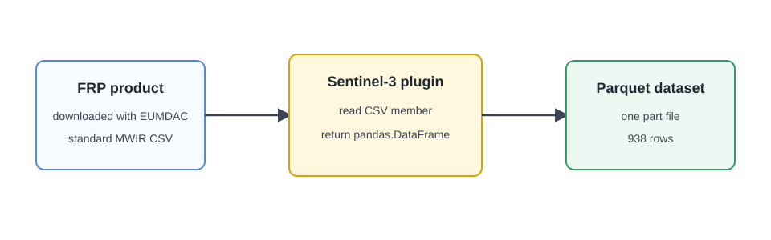

# Sentinel-3 FRP To Parquet

Download one Sentinel-3 SLSTR Level 2 Fire Radiative Power (FRP) product from
the EUMETSAT Data Store, read its standard MWIR detections, and write them to
Parquet with `GenericParquetIngestor`.

<figure markdown="span">
  { width="820" }
  <figcaption markdown="span">The plugin reads one CSV member from the EUMETSAT product; `GenericParquetIngestor` writes the returned data frame.</figcaption>
</figure>

## What You Will Do

1. Download one real Sentinel-3 FRP product with EUMDAC.
2. Create a Parquet plugin.
3. Read the standard MWIR CSV member from the product.
4. Run ingestion and verify the Parquet rows.

## Prerequisites

- Firecube installed. Start with [Installation](../quickstart/installation.md).
- [EUMDAC](https://user.eumetsat.int/resources/user-guides/eumetsat-data-access-client-eumdac-guide)
  installed in the same Python environment:

  ```bash
  uv pip install eumdac
  ```

- An EUMETSAT user account and Data Store API credentials from the
  [API key page](https://api.eumetsat.int/api-key). Configure them once before
  continuing:

  ```bash
  eumdac set-credentials YOUR_CONSUMER_KEY YOUR_CONSUMER_SECRET
  ```

The product used below belongs to EUMETSAT Data Store collection
[`EO:EUM:DAT:0417`](https://user.eumetsat.int/catalogue/EO%3AEUM%3ADAT%3A0417).

## 1. Download One FRP Product

Download a product that contains standard MWIR fire detections:

```bash
mkdir -p data/sentinel3-frp
PRODUCT_ID="S3A_SL_2_FRP____20260120T081510_20260120T082010_20260120T100737_0299_135_135______MAR_O_NR_003.SEN3"

eumdac download --yes \
  --collection EO:EUM:DAT:0417 \
  --product "$PRODUCT_ID" \
  --output-dir data/sentinel3-frp \
  --onedir
```

Expected output includes:

```text
Processing 1 product.
...
Job 1: Download complete: S3A_SL_2_FRP____20260120T081510_20260120T082010_20260120T100737_0299_135_135______MAR_O_NR_003.SEN3, ...
```

Confirm that EUMDAC wrote the product ZIP:

```bash
find data/sentinel3-frp -maxdepth 1 -type f -name "*.SEN3.zip"
```

Expected output:

```text
data/sentinel3-frp/S3A_SL_2_FRP____20260120T081510_20260120T082010_20260120T100737_0299_135_135______MAR_O_NR_003.SEN3.zip
```

## 2. Create The Plugin

```bash
uv run firecube plugins create sentinel3-frp \
  --template parquet \
  --target-dir plugins_dev \
  --non-interactive
```

Expected output:

```text
✨ Created plugin project: plugins_dev/firecube-sentinel3-frp

To install for development:
  cd plugins_dev/firecube-sentinel3-frp
  uv sync
```

## 3. Read The MWIR Detections

Replace
`plugins_dev/firecube-sentinel3-frp/src/firecube_sentinel3_frp/ingestor.py`
with:

```python
# Copyright 2025-2026 EUMETSAT
#
# Licensed under the Apache License, Version 2.0 (the "License");
# you may not use this file except in compliance with the License.
# You may obtain a copy of the License at
#
#     http://www.apache.org/licenses/LICENSE-2.0
#
# Unless required by applicable law or agreed to in writing, software
# distributed under the License is distributed on an "AS IS" BASIS,
# WITHOUT WARRANTIES OR CONDITIONS OF ANY KIND, either express or implied.
# See the License for the specific language governing permissions and
# limitations under the License.

from __future__ import annotations

import zipfile
from pathlib import Path
from typing import ClassVar

import pandas as pd

from firecube.ingestor.api import (
    GenericParquetIngestor,
    PipelineBatch,
    PluginContext,
    register_ingestor,
)


@register_ingestor("sentinel3_frp")
class Sentinel3FrpIngestor(GenericParquetIngestor):
    PRODUCT_NAME: ClassVar[str] = "sentinel3_frp"

    def build_dataset(
        self,
        group: str,
        batch: PipelineBatch,
        ctx: PluginContext,
    ) -> pd.DataFrame | None:
        _ = group
        frames: list[pd.DataFrame] = []

        for item in batch.items:
            zip_path = ctx.materialize(item)
            with zipfile.ZipFile(zip_path, "r") as archive:
                members = [
                    name
                    for name in archive.namelist()
                    if name.endswith("/FRP_MWIR1km_standard.csv")
                ]
                for member in members:
                    with archive.open(member) as handle:
                        frame = pd.read_csv(handle, comment="#")
                    if frame.empty:
                        continue

                    frame["timestamp"] = pd.to_datetime(
                        frame["day"].astype(str) + "T" + frame["time"].astype(str),
                        utc=True,
                    )
                    frame = frame.drop(columns=["day", "time"])
                    frame["source_product"] = Path(zip_path).name
                    frames.append(frame)

        if not frames:
            return None

        return pd.concat(frames, ignore_index=True)
```

The lines beginning with `#` in the source CSV are product metadata, so
`comment="#"` skips them and reads the following line as the table header.
`ctx.materialize(item)` also keeps the reader correct when the source product
comes from remote storage.

This implementation imports pandas directly. Add it to the generated
project's dependencies in
`plugins_dev/firecube-sentinel3-frp/pyproject.toml`:

```toml
dependencies = [
    "firecube>=0.1.0",
    "pyarrow",
    "pandas",
]
```

## 4. Install The Plugin

```bash
uv run firecube plugins install --editable plugins_dev/firecube-sentinel3-frp
uv run firecube plugins describe sentinel3_frp
```

Expected output from `plugins describe`:

```text
Name:        sentinel3_frp
Version:     0.1.0 (firecube-sentinel3-frp)
Module:      firecube_sentinel3_frp.ingestor
Product:     sentinel3_frp

Options Sections:
  [ENGINE]
      pipeline_workers [integer] (default: 1)
      ...
```

## 5. Run Ingestion

```bash
mkdir -p output
PRODUCT_URI="file://$PWD/output/sentinel3_frp.parquet"

uv run firecube ingest sentinel3_frp \
  --input-data data/sentinel3-frp \
  --target "$PRODUCT_URI" \
  --product-name sentinel3_frp \
  --storage-type local \
  --storage-driver fsspec \
  --output-format parquet \
  --write-mode direct
```

Expected output includes:

```text
"message":"Found 1 files"
...
"plugin": "sentinel3_frp"
...
"files_processed": 1
...
"product": "sentinel3_frp"
```

## 6. Verify The Parquet Data

```bash
uv run python - <<'PY'
from pathlib import Path

import pandas as pd

root = Path("output/sentinel3_frp.parquet")
parts = sorted(root.rglob("*.parquet"))
data = pd.read_parquet(root)

print("Parquet part files:", len(parts))
print("Rows:", len(data))
print(data[["timestamp", "lat(deg)", "lon(deg)", "FRP(MW)"]].head())

assert len(parts) == 1
assert len(data) == 938
assert data["timestamp"].notna().all()
PY
```

Expected output begins with:

```text
Parquet part files: 1
Rows: 938
                  timestamp   lat(deg)   lon(deg)    FRP(MW)
0 2026-01-20 08:16:39+00:00  13.939937  31.315907  36.124392
...
```

## Troubleshooting

- EUMDAC reports missing credentials: create a consumer key and secret on the
  EUMETSAT API key page, then run `eumdac set-credentials` again.
- No product is downloaded: confirm that your account can access collection
  `EO:EUM:DAT:0417` and that the complete product ID was copied.
- No Parquet data is written: confirm that the downloaded ZIP contains
  `FRP_MWIR1km_standard.csv` and that the product has non-empty detections.

## Next Steps

- **[Parquet](../concepts/output-formats/parquet.md)** — understand Parquet output behavior
- **[GenericParquetIngestor](../guides/plugins/generic-parquet.md)** — read the plugin class details
- **[NetCDF To Zarr: Source Discovery](source-discovery.md)** — customize built-in source discovery
- **[Run Ingestion](../quickstart/ingestion.md)** — run local and S3 examples
