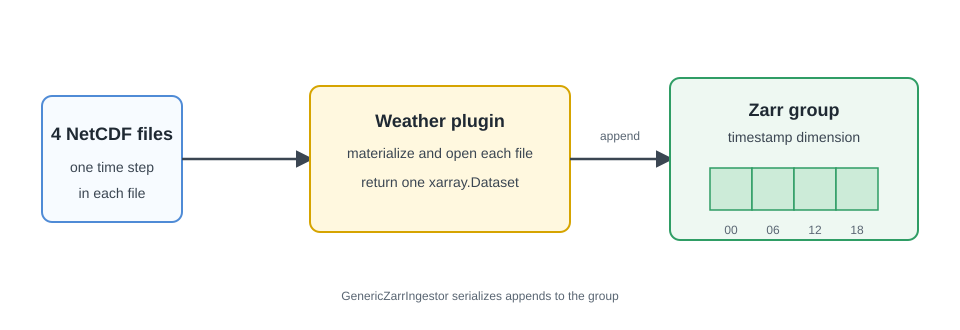

# NetCDF To Zarr

## Goal

Understand how the `weather_netcdf` plugin from the quickstart turns four
NetCDF files into one Zarr product. You will inspect the plugin contract, read
the source files, and verify the stored values.

<figure markdown="span">
  { width="860" }
  <figcaption markdown="span">The plugin reads each file and returns an `xarray.Dataset`; `GenericZarrIngestor` appends it to the Zarr group.</figcaption>
</figure>

## Prerequisites

- Complete the quickstart through [Run Ingestion](../quickstart/ingestion.md).
- Keep the quickstart virtual environment active.
- Run every command from the `firecube-quickstart/` directory.

The completed quickstart provides the plugin source under `plugins_dev/`, four
files under `quickstart-data/`, and the Zarr product under
`quickstart-output/`.

## 1. Review The Plugin Contract

Print the plugin implementation:

```bash
sed -n '1,220p' \
  plugins_dev/firecube-weather-netcdf/src/firecube_weather_netcdf/ingestor.py
```

The generated class and the `build_dataset` method each own one part of the
contract:

- `@register_ingestor("weather_netcdf")` defines the name used by
  `firecube ingest`.
- `PRODUCT_NAME` supplies the default logical product name.
- `GenericZarrIngestor` discovers and batches source files, then appends the
  dataset returned by `build_dataset`.
- `ctx.materialize(item)` resolves each source item to a local path for
  `xarray`.
- `xr.concat(...).sortby("timestamp")` combines the four time steps in order.

The quickstart owns the complete
[plugin implementation](../quickstart/plugins.md#implement-the-plugin). The
[GenericZarrIngestor guide](../guides/plugins/generic-zarr.md) explains how to
adapt the same hook for another dataset.

## 2. Inspect The NetCDF Inputs

Open each source file and print the timestamp and grid size:

```bash
python - <<'PY'
from pathlib import Path

import xarray as xr

paths = sorted(Path("quickstart-data/weather-netcdf").glob("*.nc"))
assert len(paths) == 4

for path in paths:
    with xr.open_dataset(path) as dataset:
        timestamp = dataset["timestamp"].values[0]
        print(path.name, timestamp, dict(dataset.sizes))
        assert dataset.sizes == {"timestamp": 1, "latitude": 2, "longitude": 3}
PY
```

Expected output contains one line for each file, ordered from
`weather_01.nc` through `weather_04.nc`. Each file has one timestamp on the
same 2 by 3 grid.

## 3. Verify The Zarr Product

Open the `default` Zarr group and read the temperature at the first grid
point:

```bash
python - <<'PY'
import numpy as np
import xarray as xr

dataset = xr.open_zarr(
    "quickstart-output/weather.zarr",
    group="default",
    consolidated=False,
)
values = dataset["temperature_c"].isel(latitude=0, longitude=0).values

print(dataset)
print(values.tolist())

assert dataset.sizes == {"timestamp": 4, "latitude": 2, "longitude": 3}
assert np.allclose(values, [19.4, 22.8, 27.3, 24.1])
PY
```

Expected output includes:

```text
Dimensions:                   (timestamp: 4, latitude: 2, longitude: 3)
[19.4, 22.8, 27.3, 24.1]
```

The four values keep the timestamp order defined in the source files. The
result also contains `humidity_pct` and Firecube's timestamp-state array.

## 4. Inspect The Run Record

List the control-plane record stored beside the product:

```bash
firecube chunks list \
  --product-name "file://${PWD}/quickstart-output/weather.zarr"
```

The table should contain a `span` record for the completed
`quickstart_weather` ingestion. These are logical Firecube records, not
physical Zarr array chunks.

## What Firecube Handled

- Recursive NetCDF discovery from `--input-data`
- Batch creation
- Serialized Zarr appends for the `default` group
- Product-local run and span records
- Basic run [metrics](../concepts/observability/metrics.md) and
  [logs](../concepts/observability/logs.md)

The plugin only supplied the dataset-specific read and combination logic.

## Troubleshooting

| Symptom | Cause | Fix |
|---|---|---|
| `Plugin 'weather_netcdf' not found` | The quickstart environment is inactive or the editable install is missing. | Run `source .venv/bin/activate`, then repeat the install command from the plugin page. |
| A source-file assertion fails | The four quickstart NetCDF files are missing or changed. | Repeat [Prepare Source Data](../quickstart/source-data.md). |
| `quickstart-output/weather.zarr` is missing | The quickstart ingestion has not completed. | Repeat [Run Ingestion](../quickstart/ingestion.md). |
| A changed plugin does not rewrite completed data | Firecube recognizes the source records from the earlier run. | Use a new target or pass `--option force_reingest=true` while developing. |

## Next Steps

- **[NetCDF To Zarr: Source Discovery](source-discovery.md)**: extend the same plugin run to another NetCDF filename pattern.
- **[NetCDF To Zarr: Observability](observability.md)**: add one custom metric to the same plugin.
- **[Sentinel-3 FRP To Parquet](sentinel3-frp.md)**: download and ingest a real EUMETSAT product.
- **[Parallel DirectZarrIngestor](direct-zarr-parallel.md)**: learn the slot-write path for disjoint parallel writes.
